# InterviewPro

InterviewPro is an AI-powered interview preparation platform that generates personalized mock interviews from a candidate's resume and job description. It evaluates responses, produces detailed performance reports, tracks progress across interviews, and creates targeted learning plans for continuous improvement.

---

## System Flow

### Application Workflow

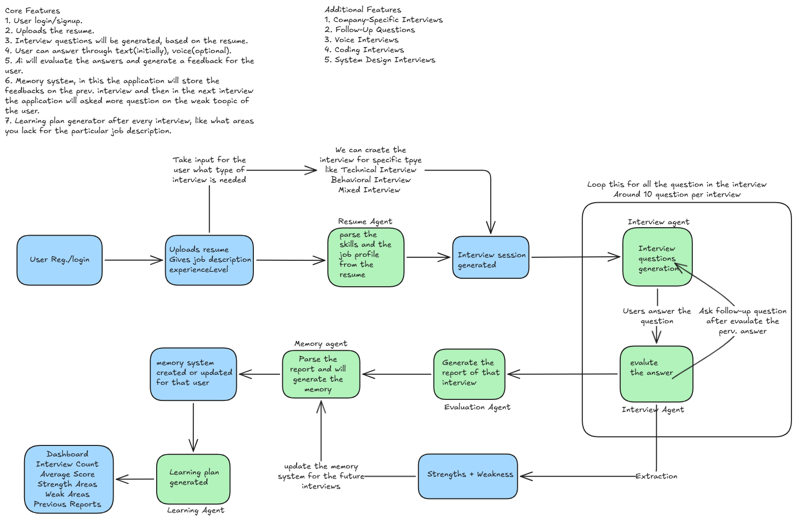

### System Architecture

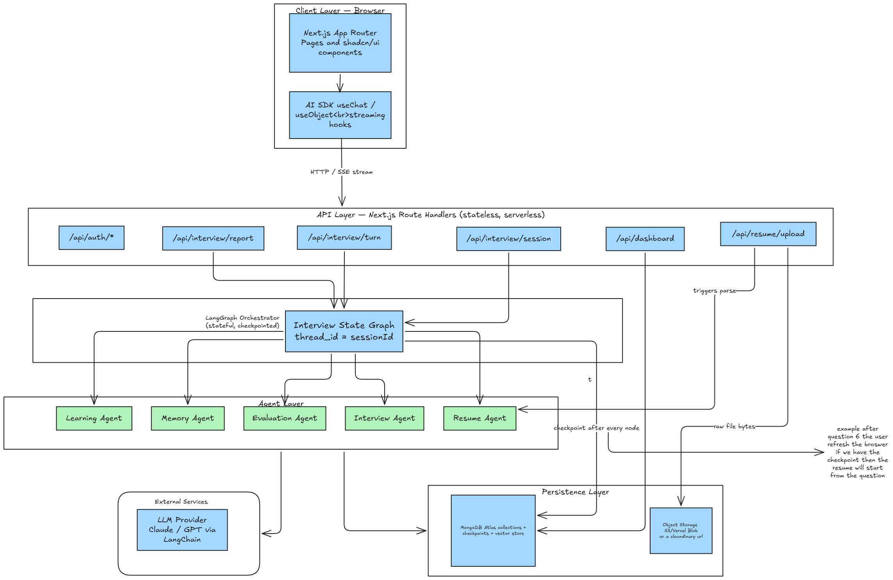

### Database Design

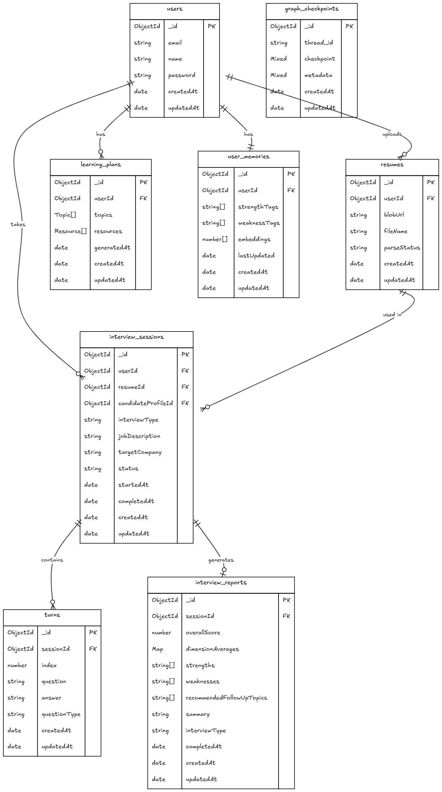

---

# Application Screens

## Landing Page

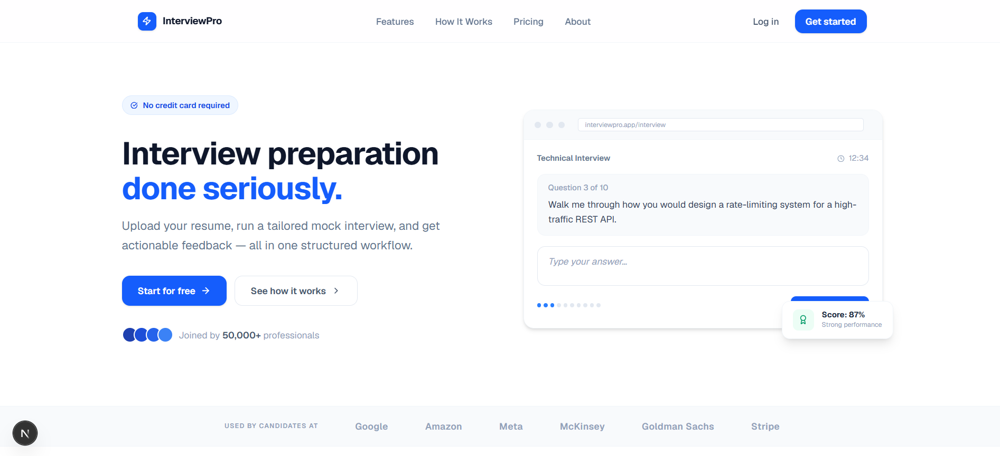

## Interview Setup

Resume upload, job description input, company targeting, and interview generation.

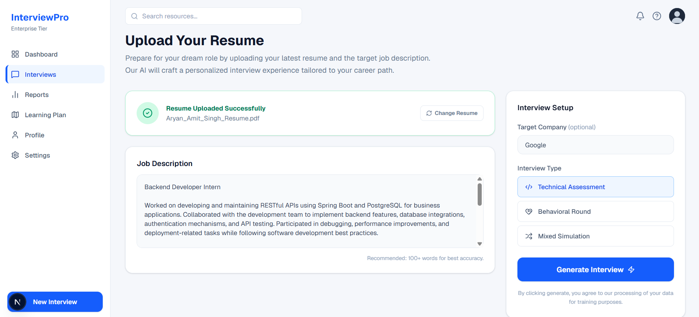

## Interview Session

Real-time interview interface with question tracking, answer submission, and progress monitoring.

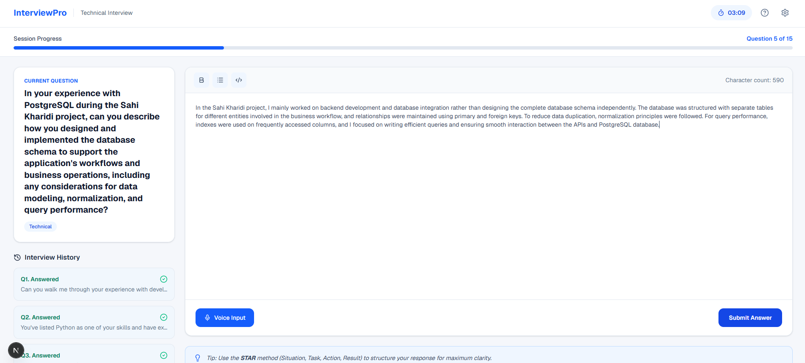

## Dashboard

Centralized overview of interview performance, strengths, weaknesses, and recent reports.

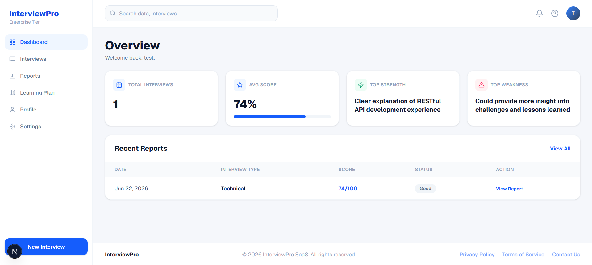

## Profile

Candidate profile with performance metrics, interview history, and skill breakdown.

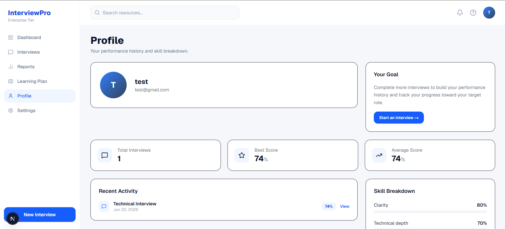

## Reports Overview

Interview history with filtering and report access.

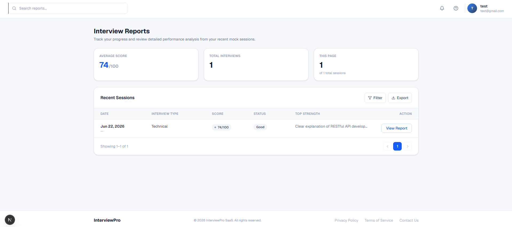

## Detailed Interview Report

Performance summary, score breakdown, and evaluation metrics.

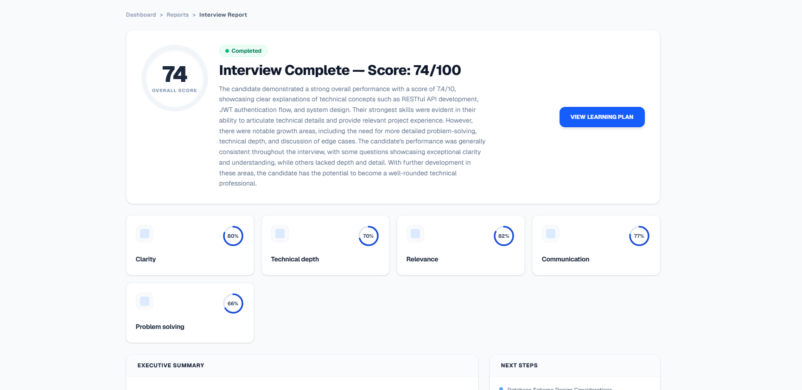

## Strengths, Weaknesses & Recommendations

Detailed analysis and personalized improvement roadmap.

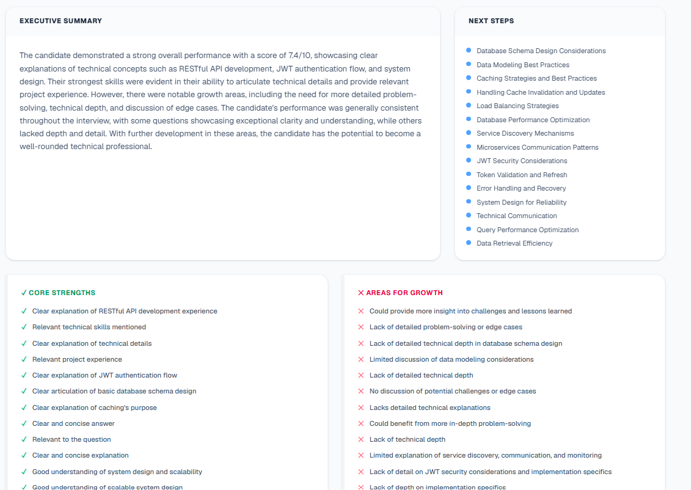

---

# Features

### Interview Generation
- Resume-based interview generation
- Job description analysis
- Technical, Behavioral, and Mixed interview modes
- Company-specific interview customization

### AI Evaluation
- Response quality assessment
- Technical depth analysis
- Communication evaluation
- Problem-solving assessment
- Follow-up question generation

### Reporting & Analytics
- Detailed interview reports
- Strength and weakness identification
- Historical performance tracking
- Skill-wise score breakdown
- Progress monitoring

### Learning System
- Personalized learning plans
- Weakness-focused recommendations
- Interview memory system
- Adaptive future interview generation

---

# Tech Stack

| Category | Technologies |
|-----------|-------------|
| Frontend | Next.js, React, Tailwind CSS |
| Backend | Next.js API Routes |
| Database | MongoDB, Mongoose |
| Authentication | JWT, HTTP-only Cookies |
| Storage | Cloudinary |
| AI Layer | OpenAI / LLM Integration |
| Orchestration | LangGraph, LangChain |
| Deployment | Vercel |

---

# Core Workflow

1. User authentication
2. Resume upload and parsing
3. Candidate profile extraction
4. Interview generation
5. Question-answer evaluation loop
6. Report generation
7. Memory update and learning plan creation
8. Dashboard and progress tracking

---

# Future Enhancements

- Voice interviews
- Coding interview environment
- System design interviews
- Advanced company-specific interview pipelines
- Multi-model AI evaluation
- Real-time interviewer simulation

---

## License

This project is intended for educational and portfolio purposes.
